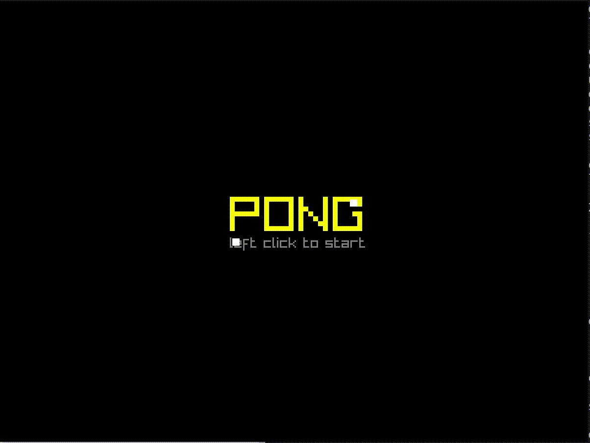

<h1 align = "center">
	The Pong Game
</h1>
A failed attempt to rewrite the original 1972 pong game in pure C.

## 🎴 **Preview**


## ⚡ **Requirements**
* [g++](https://gcc.gnu.org/)
* [Raylib](https://www.raylib.com/)

## 📦 **Setup**
* Clone this repository.
	```bash
	git clone https://github.com/ShamsParvezArka/pong.git
	```
* `cd` to the pong directory and type:
	```bash
	make 
	```
	> here, `Makefile` will compile the source code and create an executable

*  Fire your game by running the `pong` executable.
